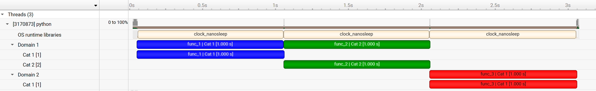

Annotation Attributes
======================

- Message

  - Associate an annotation with a message, e.g., the function name when decorating a function.

- Color

  - The color attribute can be used to guide the tool's visualization of annotations.

- Domain

  - Domains enable scoping of annotations. Each domain maintains its own categories,
    range stacks and registered strings.

  - By default, all annotations are in the default domain.
    Additional domains with distinct names can be registered by using :func:`nvtx.get_domain`.

  - It is recommended to use a single (non-default) domain per library.

- Category

  - Categories can be used to group annotations within a domain.

- Payload

  - A numeric value associated with the annotation.

**Example:**

::

   import time
   import nvtx

   @nvtx.annotate(color="blue", domain="Domain 1", category="Cat 1")
   def func_1():
       time.sleep(1)

   @nvtx.annotate(color="green", domain="Domain 1", category="Cat 2")
   def func_2():
       time.sleep(1)

   @nvtx.annotate(color="red", domain="Domain 2", category="Cat 1")
   def func_3():
       time.sleep(1)

   func_1()
   func_2()
   func_3()

Profiling the above code with Nsight Systems will produce the following timeline:

