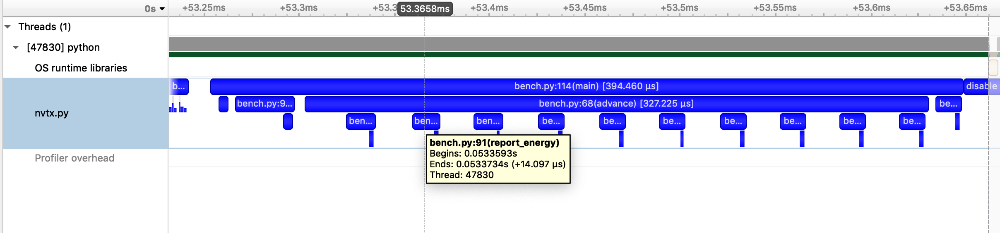

Automatic function annotation
=============================

``nvtx``  can automatically annotate each function call in your program.
Note that doing this adds a tiny amount of
overhead to each and every function invocation, which can significantly
impact the overall runtime.

Command-line interface
----------------------

``nvtx`` can be invoked as a command-line script, which annotates every function call,
with no changes to the source code:

::

   python -m nvtx script.py

The Profile class
-----------------

You can also use :func:`nvtx.Profile` to enable and disable
automatic function annotation in different parts of
your program:

::

   pr = nvtx.Profile()
   pr.enable()  # begin annotating function calls
   # -- do something -- #
   pr.disable()  # stop annotating function calls
