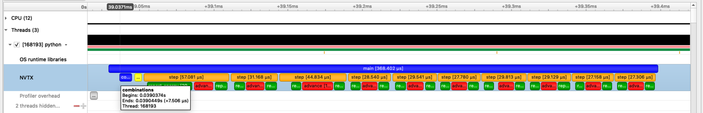
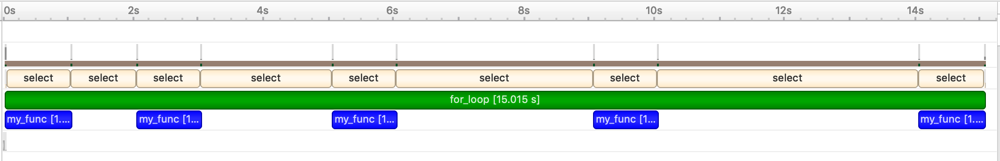

.. nvtx documentation master file, created by
   sphinx-quickstart on Wed May  6 16:27:08 2020.
   You can adapt this file completely to your liking, but it should at least
   contain the root `toctree` directive.

==================================================
Python NVTX - Annotate code ranges and events in Python
==================================================

| NVTX is a cross-platform API for annotating source code to provide contextual
  information to developer tools.
  The ``nvtx`` package provides a Python interface to the NVTX C API.
| By default, NVTX API calls do **nothing**. When a program is launched from a developer tool
  (such as `NVIDIA Nsight Systems <https://developer.nvidia.com/nsight-systems>`_),
  NVTX API calls are redirected to the tool's functions.
| Using `NVIDIA Nsight Systems <https://developer.nvidia.com/nsight-systems>`_,
  The NVTX events can be visualized and analyzed in the timeline view.

|

Installation
============

Install using `conda` (preferred):
::

   conda install -c conda-forge nvtx

Install using `pip`:
::

   python -m pip install nvtx

Quick Demo
==========

Here is an example of using ``nvtx``:

::

   # demo.py

   import time
   import nvtx

   def sleep_for(i):
       time.sleep(i)

   @nvtx.annotate()
   def my_func():
       time.sleep(1)

   with nvtx.annotate("for_loop", color="green"):
       for i in range(5):
           sleep_for(i)
           my_func()

Profile the code above using Nsight Systems CLI:

::

   nsys profile python demo.py

This produces a report file (``.nsys-rep``) which can be viewed in the Nsight Systems GUI:

|

.. toctree::
   :maxdepth: 2

   overview

.. toctree::
   :maxdepth: 1

   reference

.. toctree::
    :hidden:
    :caption: Project Links

    GitHub <https://github.com/NVIDIA/NVTX/>
    PyPI <https://pypi.org/project/nvtx/>
    C Docs <https://nvidia.github.io/NVTX/doxygen/>
    C++ Docs <https://nvidia.github.io/NVTX/doxygen-cpp/>
