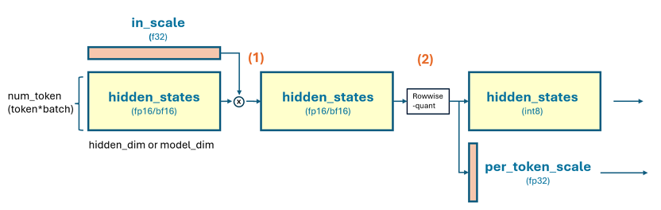

# Layernorm2D forward

This folder contains example for Layernorm2D forward using `ck_tile` tile-programming implementation.

# Implementation and feature support

## welford online algorithm
We use welfold algorithm to update `mean`/`variance` block by block. For `N <=4096` case we can compute `mean`/`var`/`normalization` within one loop, we call it `one-pass`. For large N case, it is hard to keep `mean`/`var` inside register/LDS and then computation `normalization`, so we need to load input twice, first time to compute `mean`/`var` block-by-block, then load input another time to compute the `normalization`. We call it `two-pass`.

## mean/variance save
In training case the mean/variance need to store out (TBD, not supported yet)

## prenorm/postnorm


since [prenorm/postnorm](https://arxiv.org/pdf/1906.01787) is quite common in LLM blocks, this example boosts this feature by kernel fusion. Note that `prenorm`/`postnorm` always need to do elementwise-add a `shortcut` before the actual layernorm computation, and optionally store out the result to global. You can use `-fadd=1` to test `pre-add+store`, or `-fadd=2` to test `pre-add` without store out (not codegen by default).

## smooth-quant/dynamic-quant
we support smooth/dynamic quantization for `int8` output, by setting `-fquant=1` and `-prec_o=int8`. In this case the output will doing a rowwise dynamic quantization like below. Note that smooth-quant require input a `(1*N)` size per-channel scale(in fp32 in our example, though this is customizable), then elememt-wise multiply the tensor for each row, then compute the rowwise dynamic quant. if set `-fquant=2` will have the input per-channel scale stage, only the dynamic quant. This case is supported in our kernel but by default not generated (TBD: add some filter in generate.py support on-demand codegen)


```
# assume output int8, hidden_states is [m, n] shape and in fp16/bf16
# [m, 1]
per_token_amax, _ = torch.max(
     input=torch.abs(hidden_states), 
     dim=-1, 
     keepdim=True
)
per_token_scale = per_token_amax.to(dtype=torch.float32) / 127.0

# quant hidden_states
hidden_states = (hidden_states / per_token_scale).to(dtype=torch.int8)

return hidden_states, per_token_scale
# hidden_states now is int8 will feed to next layer as intput
# per_token_scale will be used as dequant factor later layer
```

## build
```
# in the root of ck_tile
mkdir build && cd build
sh ../script/cmake-ck-dev.sh  ../ <arch>  # you can replace this <arch> to gfx90a, gfx942...
make tile_example_layernorm2d_fwd -j
```
This will result in an executable `build/bin/tile_example_layernorm2d_fwd`

## example
```
args:
          -m    m dimension (default:3328)
          -n    n dimension (default:4096)
     -stride    stride per row, if -1 then equal to n (default:-1)
          -e    epsilon (default:1e-5)
    -save_mv    save mean/variance(invstd) or not. set to 1 in training case (default:0)
          -v    cpu validation or not (default:1)
      -kname    print kernel name or not (default:1)
     -prec_i    input precision (default:fp16)
     -prec_o    output precision, set auto will be the same as input (default:auto)
    -prec_sm    output quant scale type, set auto will be the same as input. used when fquant=1 (default:auto)
    -prec_sy    output quant scale type, set auto will be the same as input. used when fquant=1 or 2 (default:auto)
       -fadd    fused-add, 0:no fused add, 1:preadd+store, 2:preadd only (default:0)
     -fquant    fused-quant, 0:no, 1:smooth-dynamic-quant, 2:dynamic-quant (default:0)
     -warmup    cold iter (default:5)
     -repeat    hot iter (default:20)

```

## limitations
Note that `fquant=2`, `fadd=2`, `prec_sm/prec_sy` other than `fp32` are not by default generated. Though our kernel template suppor this. (TBD: add some flag in generate.py) to generate those instance on demand. Beside, `N>8192` case will by default using two-pass pipeline, and `-fquant=1/2` are not supported yet. If need suport `N>8192` and `fused+residual+store`, you can use this example together with `12_smoothquant`, to construct layernorm+residual, and smoothquant, 2 kernels for this purpose.

```
# some case
# standard fp16 layernorm 2d, m=10. n=1024
./build/bin/tile_example_layernorm2d_fwd  -m=10 -n=1024

# standard fp16 layernorm 2d, m=10. n=1024, fused-smooth-quant, output in int8
./build/bin/tile_example_layernorm2d_fwd  -m=10 -n=1024 -prec_o=int8 -fquant=1

# standard fp16 layernorm 2d, m=10. n=1024, fused-smooth-quant+fused-add-store, output in int8
./build/bin/tile_example_layernorm2d_fwd  -m=10 -n=1024 -prec_o=int8 -fquant=1 -fadd=1

```
