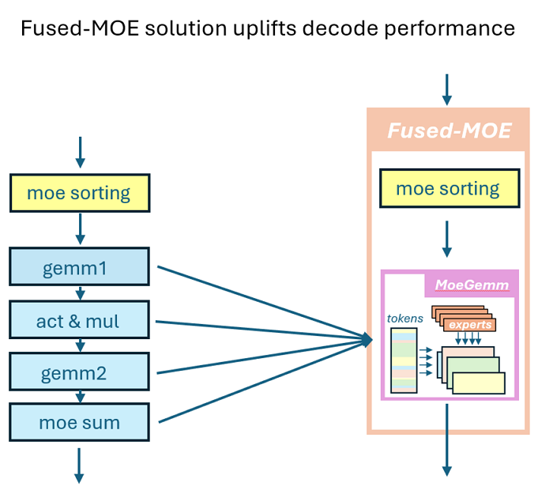
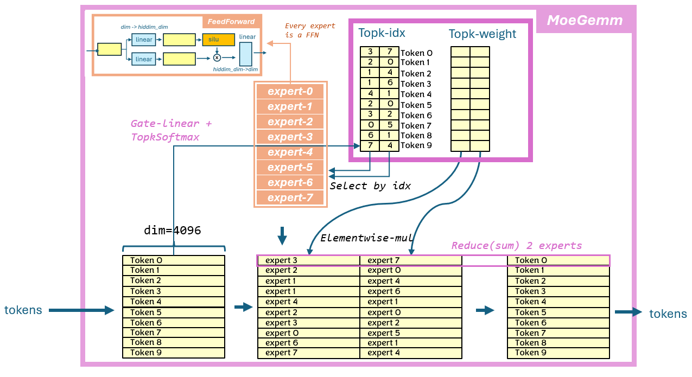
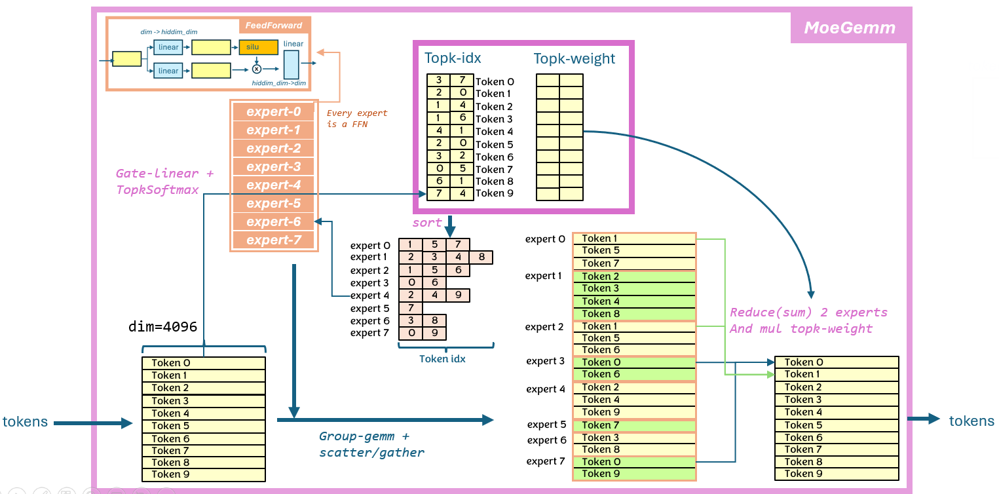

# fused-moe
Implementing the fused-moe block operator using ck-tile. This is a scatter/gather-group-gemm based solution, similiar to that of [vllm moe](https://github.com/vllm-project/vllm/blob/main/benchmarks/kernels/benchmark_moe.py), but we introduce more kernel fusion to boost performance


The benifit of this fused-moe:
* 1.5~2x perf boost compared with current vllm solution
* zero workspace to reduce memory footprint
* much less kernel instance, easy to maintain

# Implementation and feature support
## NOTES:
currently gate+up in fp16 case will very easily cause accumulator overflow the fp16 max(65504), hence result in INF. Please use BF16 for gate+up case, API side will have no check for this.

## moe-sorting
this is a common pre-process step before the actual moe-gemm. The purpose is to transform the moe loop over from token-by-token to expert-by-expert, make sure very workgroup is working for a single expert (B matrix). Besides, we extend this op to do the zeroing of the output buffer(to be used for reduce buffer with atomic)

## moe-gemm
`moe-gemm` is a group-gemm based back-to-back gemm, where the row-id of input token comes from another buffer. Naive understanding of fused-moe is from token-by-token view as below picture:

After `moe-sorting`, we can view this algorithm as expert-by-expert, as below:


## optimization
summary of the key design of this fused-moe operator:
* fuse 2 group-gemm + activation + `topk-weight` multiply into single kernel, using atomic for 2nd gemm accumualation
* fuse buffer-zeroing in `moe-sorgin`, user no longer need call extra torch.zero() for the out buffer
* fused scatter-gather for row index(same as vllm)
* pre-shuffle B matric(weight) to maximize memory throughput. input(activation) keep original layout `[batch, hidden]`.
* extrem optimized pipeline using block-inline-asm(we call it `micro-kernel` or `uk`), while not breaking the *composable* design of ck

## 
```
// [indexing implementation-1]
// using M_a as constexpr block_size to partition all tokens into different slices
// each slice map to one expert, and one expert can have multiple slices
// e.g. num_experts = 6, topk=3, M_a = 4, input_tokens = 5
// before sort, topk_ids is : [[0, 3, 5], [2, 3, 5], [1, 3, 5], [1, 2, 3], [1, 3, 5]]
//                            tok-0      tok-1      tok-2      tok-3      tok-4
//           topk_weight is : [[a, b, c], [d, e, f], [g, h, i], [j, k, l], [m, n, o]] (some float number)
//
// token_id_per_expert is : [[0], [2, 3, 4], [1, 3], [0, 1, 2, 3, 4], [], [0, 1, 2, 5]]
//  (only for reference)    exp-0  exp-1     exp-2   exp-3          exp-4  exp-5
// weight_id_per_expert is: [[a], [g, j, m], [d, k], [b, e, h, l, n], [], [c, f, i, o]]
//
// max_num_tokens_padded : topk * input_tokens + num_experts * M_a - topk (updated)
// * this could be larger than actual, since actual tokens are on GPU
//
// sorted_token_ids_ptr   : [0, 6, 6, 6, 2, 3, 4, 6, 1, 3, 6, 6, 0, 1, 2, 3, 4, 6, 6, 6, 6, 6, 6, 6, 0, 1, 2, 5]
//                          |-  exp-0  -|-  exp-1  -|-  exp-2  -|-      exp-3          -|-  exp-4 -|-  exp-5  -|
// sorted_weight_ptr      : [a, *, *, *, g, j, m, *, d, k, *, *, b, e, h, l, n, *, *, *, *, *, *, *, c, f, i, o]
//
// * length is max_num_tokens_padded, actual size is num_tokens_post_padded_ptr
//
// sorted_expert_ids_ptr  : [0, 1, 2, 3, 3, 4, 5]
// * length is (max_num_tokens_padded + block_size - 1) / block_size
//
// num_tokens_post_padded_ptr : [28]
// num_sorted_tiles_ptr : [7]
//
// * different from vLLM
//   1) token_id stored in sorted_token_ids_ptr is actual token_id, not token_id*top_K expanded id
//   2）need sorted_weight_ptr
//   3) use num_sorted_tiles_ptr, already divided by M_a
//
// * below used for indexing
//  1) sorted_token_ids_ptr [max_num_tokens_padded]
//  2) sorted_weight_ptr
//  3) sorted_expert_ids_ptr
//  4）num_tokens_post_padded_ptr/num_sorted_tiles_ptr (select one)
//
//   max_num_tokens_padded: opk_ids.numel() + num_experts * (block_size - 1)
```