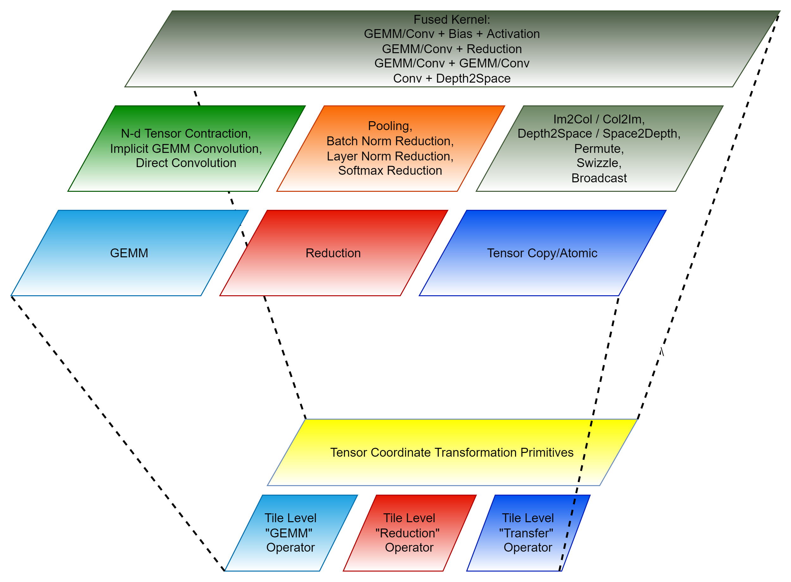
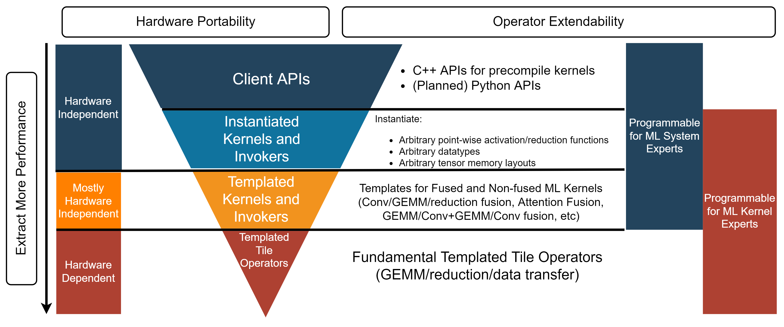

.. meta::
  :description: Composable Kernel structure
  :keywords: composable kernel, CK, ROCm, API, structure

.. _what-is-ck:

********************************************************************
Composable Kernel structure
********************************************************************

The Composable Kernel library uses a tile-based programming model and tensor coordinate transformation to achieve performance portability and code maintainability. Tensor coordinate transformation is a complexity reduction technique for complex machine learning operators.
  

The Composable Kernel library consists of four layers: 

* a templated tile operator layer
* a templated kernel and invoker layer
* an instantiated kernel and invoker layer
* a client API layer.

A wrapper component is included to simplify tensor transform operations.

   