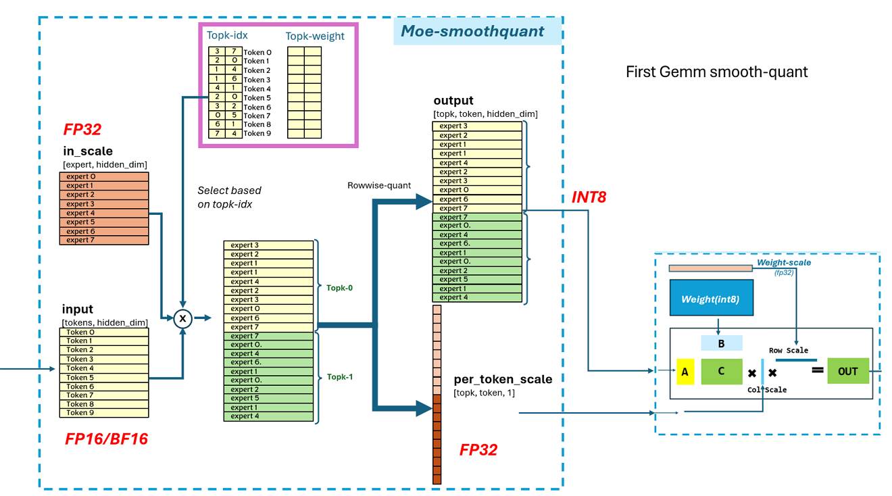

# moe-smoothquant

This folder contains example for moe-smoothquant using ck_tile tile-programming implementation.


Unlike standard smoothquant op, the input scale is from different expert `[expert, hidden]`, we need reuse the `topk-id` from previous `topk-softmax` and select the corresponding `expert` from current topk, and expand the output/per-token-scale by `topk`

## build
```
# in the root of ck_tile
mkdir build && cd build
sh ../script/cmake-ck-dev.sh  ../ <arch>  # you can replace this <arch> to gfx90a, gfx942...
make tile_example_moe_smoothquant -j
```
This will result in an executable `build/bin/tile_example_moe_smoothquant`
